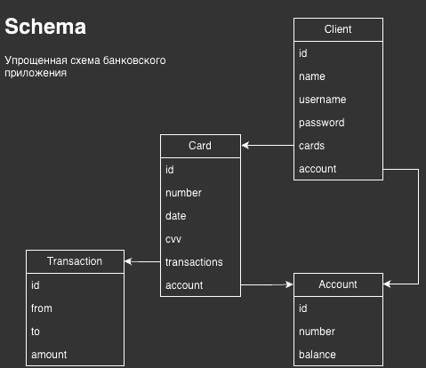
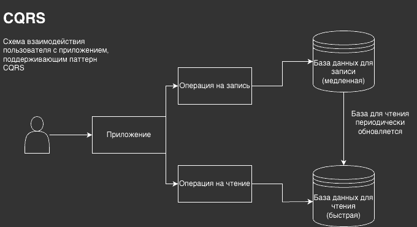
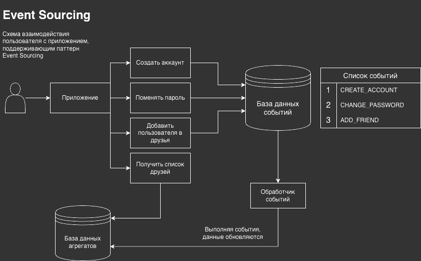
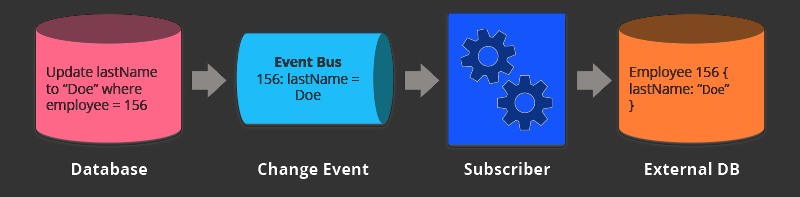

[](https://github.com/javacoded78/banking-cqrs-app)


# CQRS and Event-Sourcing Banking App

Banking app example for **CQRS and Event-Sourcing pattern**.

## Application schema



## CQRS and Event-Sourcing





## Change Data Capture



## Usage

To start an application you need to pass variables to `.env` file. Look
at `.env.example` file with some predefined environments.

All services are running in docker containers. To start the application
you need to run `docker-compose up -d` command.

**NOTE**: after Debezium connect is started, apply source config manually.

```shell
cd /on-startup/

sh run.sh
```

Application is running on port `8080` for backend and `8081` for event handler.

You can access endpoints and make requests to the application.

## How to contribute

If you found a bug or want to improve the application, feel free to create
an [issue](https://github.com/JavaCoDED78/banking-cqrs-app/issues).